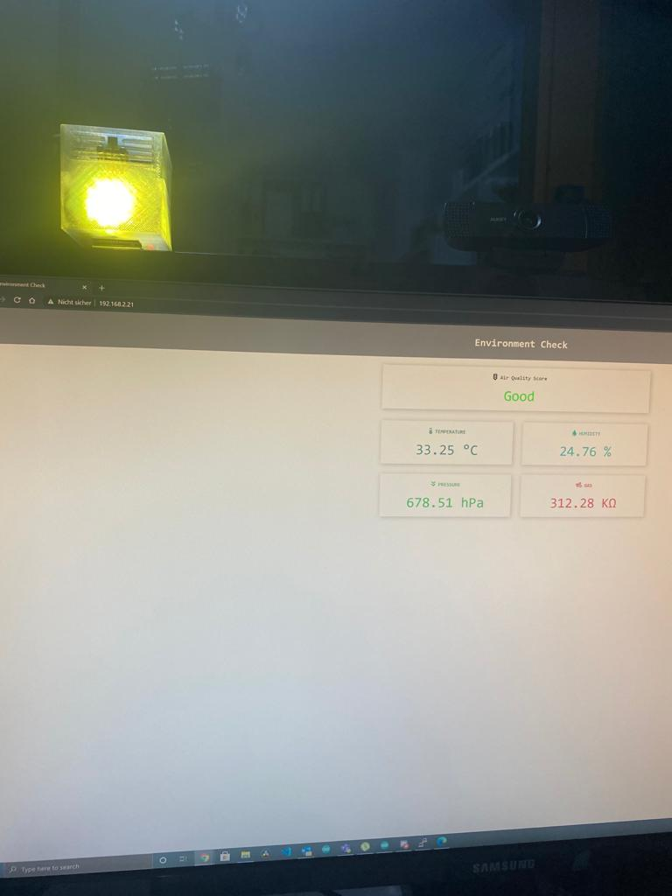

# AirQualityChecker
Measure the air quality with the help of BME680 in order to find out when it's time to ventilate the room.

# Thanks to
Many thanks to Rui Santos for providing the base idea https://randomnerdtutorials.com/esp32-bme680-sensor-arduino/, to G6EJD for the air quality score - https://github.com/G6EJD/BME680-Example/blob/master/ESP32_bme680_CC_demo_03.ino and to the AirSniffer project https://www.stall.biz/project/der-airsniffer-schlechte-luft-kann-man-messen.

# Current Version
This version creates a small web server which can be accessed in order to get the temperature, humidity, air pressure, gas resistance as well as the air quality. In addition, a RGB led can be used in order to visualize the current state of the room air quality.

# Update 04-02-2021
Add MQTT Support

# Update 05-02-2021
Get gas reference every 5 times, LED fix and send values through seperate MQTT channels in addition

# One word to the gas sensors
One must also point out the limits of the sensors used here: In particular, gas sensors are more qualitative sensors, with which one can very well show deterioration compared to fresh air also quantitatively, but the absolute values are to be “treated with caution”. Actually you should calibrate these sensors with fresh air as well as with a calibration gas, but you can't pay for that in the hobby area. In addition, this calibration would have to be repeated regularly because these sensors age or change over time. For the qualitative assessment of the indoor air quality and the derivation of ventilation recommendations in the smart home, these sensors are definitely sufficient. You just have to be aware of these limited properties!

# Getting started
* Clone the repository to your local PC
* Open the sketch with Arduino
* Change the values the secrets.h file according to your needs
* Change the defines in the sketch according to your needs
* Install all dependencies
* Choose the right hardware board (if not listed, add https://dl.espressif.com/dl/package_esp32_index.json to the additional board manager urls)
  * Currently ESP32 DevKit and MH ET live are tested, but it should work with other boards as well
  * If you want to use an ESP8266 you will slightly have to change the reference to Wifi and WebServer as well as the calls to the methods and parameters
* Flash and have fun

